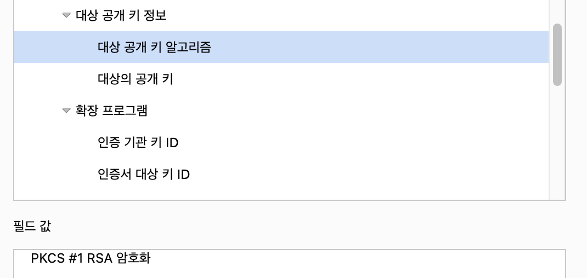
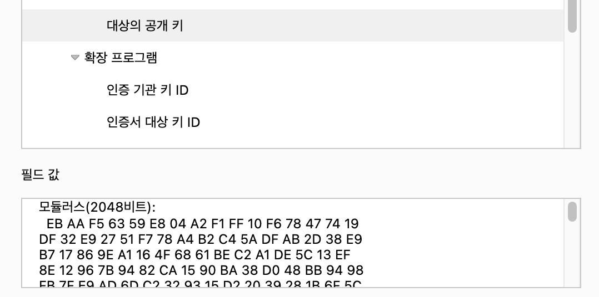
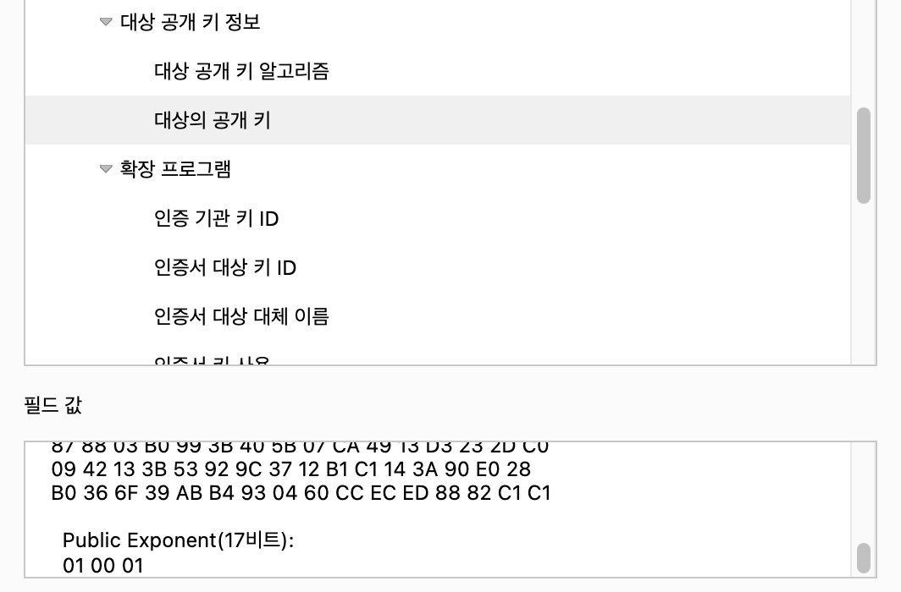

# RSA
공개 키 암호시스템 중 하나로, 전자서명 기능 인증을 요구하는 전자 상거래등에 광범위하게 사용된다.

## 공개 키 암호 방식
비대칭 암호라고도 부르며 암호화와 복호화에 이용하는 키가 다른 방식을 말한다.
- 공개 키 암호 - 특정한 비밀 키를 가지고 있는 사용자만 내용을 열어볼 수 있음
- 공개 키 서명 - 특정한 비밀 키로 만들었다는 것을 누구나 확인할 수 있음

## 기초 사실
RSA는 밑 2개의 사실에 기초한다.
- 나머지 연산에서 거듭제곱근 문제는 어렵다.
- 큰 수의 소인수 분해는 어렵다.   

이 두 사실 중 1개라도 거짓이 된다면(2개 중 1개라도 다항 시간 안에 풀린다면) RSA 암호화 체계는 안전하지 않게 된다.   
그러나 현재까지는 다항 시간에 풀리는 알고리즘이 없기 때문에 안심해도 된다.

## 장점
- 보내는 사람과 받는 사람이 미리 key 공유를 안해도 된다.

# 실제
[네이버](www.naver.com)의 인증서를 보면

RSA 암호화 방식으로 되어 있고, 2048비트로 되어 있다.(실제 서비스에서는 안전해야 하므로 매우 큰 숫자를 사용)   
e는 크지 않아도 된다.

# 코드
[RSA 코드 예제](https://github.com/wonu606/TIL/blob/main/others/RSA/RSA.py)

